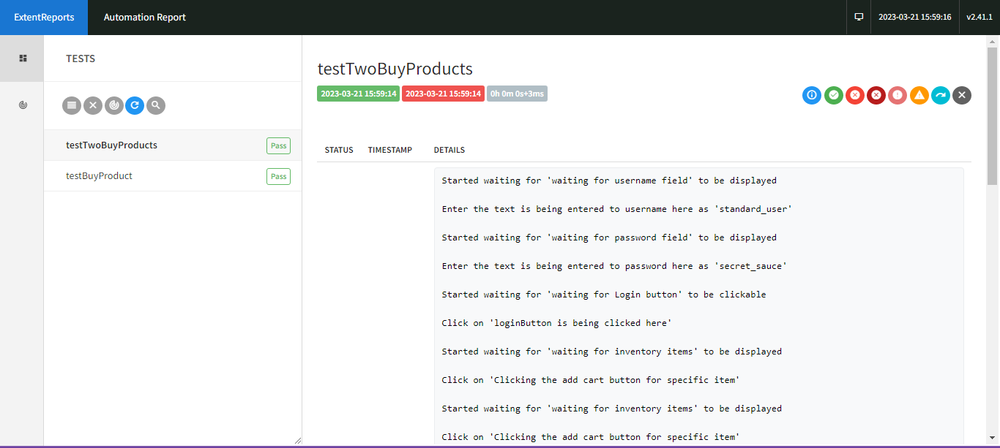
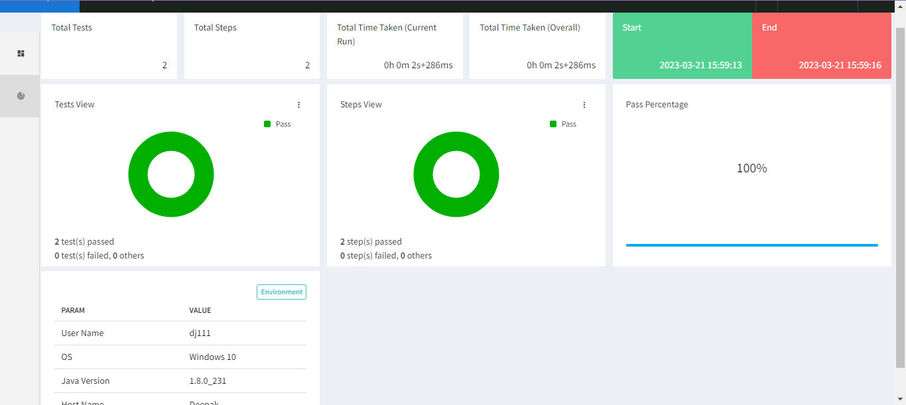

# Aspire Web Automation Test Framework

This is a Web Automation Framework built using Selenium + Java + TestNG + Gradle

Framework Tree Structure of the Major Components

```
.
|-- Drivers
|   |-- IEDriverServer.exe
|   |-- SafariDriver.safariextz
|   |-- chromedriver
|   |-- chromedriver.exe
|   |-- geckodriver
|   |-- geckodriver.exe
|   `-- versions.txt
|-- ExtentReportsTestNG.html
|-- Parameters
|   |-- config.properties
|-- build.gradle
|-- settings.gradle
|-- src
|   |-- main
|   |   `-- java
|   |       `-- TestAutomation
|   |           |-- helpers
|   |           |   |-- AssertHelper.java
|   |           |   |-- BasePage.java
|   |           |   |-- Browser.java
|   |           |   |-- CommonUtilities.java
|   |           |   |-- Config.java
|   |           |   |-- DataGenerator.java
|   |           |   |-- ExtentReporter.java
|   |           |   |-- Log.java
|   |           |   |-- TestBase.java
|   |           |   |-- TestListener.java
|   |           |   `-- WaitHelper.java
|   |           `-- pageObjects
|   |               `-- SauceDemoLoginPage.java
|   `-- test
|       `-- java
|           `-- TestAutomation
|               `-- TestBuyNow.java
|-- test-output
|-- pom.xml
`-- testng.xml

```

# How to Run Tests

To Run your assignment tests you can configure them as a part of the suite in `testng.xml` file and execute the following gradle command
`gradle cleanTest test --info
`

To Run your assignment tests you can configure them as a part of the suite in `testng.xml` file and execute the following maven command
`mvn clean test`

Or just right click on the testng.xml file to run it -> It will run both the tests

# Data
1. Validation data is there in tests classes itself
2. Static data for url, username and password has been added to the config.properties
3. Page object model has been used and integration of pages has been done in the same

# Reports
Extent reports is used and [ExtentReportsTestNG.html](ExtentReportsTestNG.html) has been generated for the same



